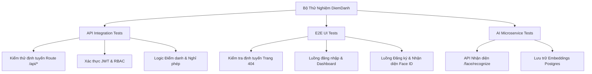

# 🧪 DiemDanh — Professional Testing Suite

Chào mừng bạn đến với bộ thử nghiệm (Testing Suite) chuyên nghiệp của dự án **Hệ Thống Điểm Danh Face ID (DiemDanh)**. Bộ test này được thiết kế để kiểm thử toàn diện toàn bộ các lớp của hệ thống, giúp phát hiện sớm các lỗi định tuyến (404 Not Found), lỗi logic nghiệp vụ, và đảm bảo tính ổn định của các dịch vụ trước khi đưa vào vận hành thực tế.



---

## 📁 Cấu Trúc Thư Mục Thử Nghiệm

Bộ test được tổ chức khoa học trong thư mục `tests/`:

```text
d:/DiemDanh/tests/
├── README.md               # Tài liệu hướng dẫn sử dụng (File này)
├── run-tests.bat           # File script chạy nhanh tất cả test trên Windows
├── package.json            # Cấu hình các dependencies và scripts của bộ test
├── api/                    # Thử nghiệm liên kết API (API Integration Tests)
│   ├── auth.test.js        # Kiểm thử Authentication & Phân quyền
│   ├── attendance.test.js  # Kiểm thử ca làm việc & điểm danh
│   └── api-client.js       # Client HTTP helper để gọi API hệ thống
├── e2e/                    # Thử nghiệm giao diện End-to-End (Playwright)
│   ├── pages.spec.js       # Quét toàn bộ trang để xác nhận không bị lỗi 404
│   └── flow.spec.js        # Luồng Login -> Dashboard -> Đăng ký Face ID -> Điểm danh
└── ai/                     # Thử nghiệm riêng cho AI Face Recognition Service
    ├── pytest.ini          # Cấu hình pytest cho Python
    └── test_ai_service.py  # Mock ảnh để kiểm tra nhận diện của InsightFace
```

---

## 🚀 Hướng Dẫn Chạy Thử Nghiệm Quick Start

### 1. Chuẩn Bị Môi Trường
Đảm bảo hệ thống Docker của bạn đang chạy bình thường (`docker compose ps` hiển thị đầy đủ 7 services hoạt động).

### 2. Cài Đặt Dependencies Cho Bộ Test (Chạy trên máy Host)
Mở terminal trên máy tính của bạn và truy cập thư mục `tests`:

```bash
cd d:\DiemDanh\tests
npm install
```

### 3. Cài Đặt Trình Duyệt Không Đầu (Headless Browsers) Cho Playwright E2E
Playwright cần tải xuống các trình duyệt để mô phỏng người dùng thực tế:

```bash
npx playwright install chromium
```

### 4. Chạy Tất Cả Các Test
Bạn chỉ cần nhấp đúp vào file `run-tests.bat` hoặc chạy lệnh sau trong terminal:

```bash
run-tests.bat
```

Hoặc chạy lẻ từng phần bằng npm scripts:
*   **Chạy toàn bộ API Tests:** `npm run test:api`
*   **Chạy E2E Web UI Tests:** `npm run test:e2e` (Kiểm tra lỗi 404 trên các trang giao diện)
*   **Xem giao diện chạy E2E (UI Mode):** `npx playwright test --ui`

---

## 📝 Nội Dung Chi Tiết Các Bộ Test

### 1. E2E UI Tests (Playwright)
Bộ test này sẽ giả lập một trình duyệt Chrome thực tế:
*   Truy cập `http://localhost/` và xác minh việc chuyển hướng (Redirect) hoạt động.
*   Kiểm tra trang `/login` có bị lỗi 404 không, điền thông tin tài khoản và đăng nhập.
*   Truy cập lần lượt tất cả các trang nội bộ: `/dashboard`, `/attendance`, `/employees`, `/timesheets`, `/leave`, `/reports`, `/settings` để đảm bảo **không có trang nào trả về lỗi 404**.
*   Kiểm tra sự hiển thị đầy đủ của Sidebar, Header và các biểu đồ thống kê.

### 2. API Integration Tests (axios + Jest)
Gọi trực tiếp các REST API của cổng Nginx `/api/*` để kiểm tra tính toàn vẹn:
*   `POST /api/auth/login` và lưu trữ JWT Token.
*   `GET /api/auth/me` để kiểm tra thông tin phiên làm việc.
*   `GET /api/users` và kiểm tra phản hồi danh sách nhân viên.
*   `GET /api/departments` và `GET /api/shifts` để đảm bảo các bảng danh mục hoạt động hoàn hảo.
*   Xác minh các mã lỗi (`401 Unauthorized` khi không truyền Token, và không có `404 Not Found` trên các API chuẩn).

### 3. AI Service Tests (Python)
Mô phỏng quy trình của OpenCV gửi ảnh dạng file bytes trực tiếp lên API của AI service tại `http://localhost/ai` để xác thực:
*   Mã phản hồi HTTP của `/ai/health` là `200 OK` và Face Engine đang ở trạng thái `initialized: true`.
*   Mock gửi yêu cầu nhận diện và đăng ký để kiểm tra tích hợp.

---

Chúc bạn có trải nghiệm kiểm thử tốt nhất! Bộ test này là minh chứng rõ nét cho một dự án cấp doanh nghiệp (Enterprise-Ready).
